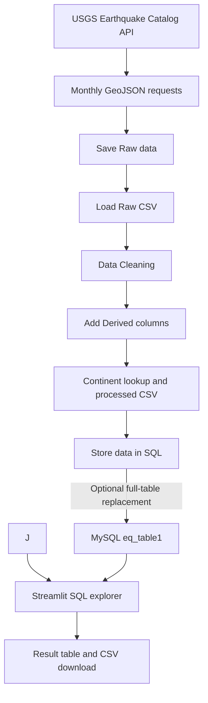

# Global Seismic Trends

**Earthquake catalog analysis with Python, Pandas, MySQL, and Streamlit.**

Global Seismic Trends explores earthquake magnitudes, depths, timing, location labels, reporting networks, and selected catalog quality indicators. A Python pipeline retrieves records from the USGS Earthquake Catalog, prepares a dataset, and optionally loads it into MySQL. A separate Streamlit application lets users select analytical questions, inspect their SQL, view results, and download them as CSV.

This is a descriptive analysis project. Its casualty and economic-loss questions use demonstration proxy weights, and its nearby-event-pair analysis is currently a placeholder.

## Contents

- [Global Seismic Trends](#global-seismic-trends)
  - [Contents](#contents)
  - [Project Features](#project-features)
  - [Technology stack](#technology-stack)
  - [Project structure](#project-structure)
  - [Data workflow](#data-workflow)
    - [Pipeline execution order](#pipeline-execution-order)
    - [Extraction window](#extraction-window)
  - [Dataset and derived fields](#dataset-and-derived-fields)
    - [Classification thresholds](#classification-thresholds)
    - [Missing-value treatment](#missing-value-treatment)
  - [Setup and configuration](#setup-and-configuration)
    - [Prerequisites](#prerequisites)
    - [1. Create a virtual environment](#1-create-a-virtual-environment)
    - [2. Install the imported dependencies](#2-install-the-imported-dependencies)
    - [3. Configure MySQL](#3-configure-mysql)
    - [4. Supply and align the query catalog](#4-supply-and-align-the-query-catalog)
  - [Run the project](#run-the-project)
    - [Generate the raw and processed CSV files](#generate-the-raw-and-processed-csv-files)
    - [Prepare the database-creation helper before uploading](#prepare-the-database-creation-helper-before-uploading)
    - [Upload the existing processed CSV](#upload-the-existing-processed-csv)
    - [Start the dashboard](#start-the-dashboard)

## Project Features

- Retrieve USGS GeoJSON records in monthly batches with a minimum magnitude of 3.
- Flatten event properties and coordinates into a Pandas DataFrame.
- Export raw and processed CSV datasets.
- Derive year, month, day, weekday, and hour from event timestamps.
- Extract location labels from `place` and apply 27 targeted regex replacement rules.
- Convert selected numeric fields and fill selected missing values with column medians.
- Create depth and magnitude categories.
- Assign continent labels using cached country lookup and keyword fallback rules.
- Optionally replace a MySQL table with the processed dataset.
- Select a SQL question, inspect the SQL, run it, and download the result through Streamlit.

The supplied `app.py` implements the SQL explorer. Although some saved screenshots include overview, map, and data-quality tabs, those views are not implemented in this file. Plotly is imported but is not currently used to render charts.

## Technology stack

| Component | Purpose |
| --- | --- |
| Python | Pipeline orchestration and application logic |
| Requests | USGS API requests |
| Pandas | Data preparation, CSV handling, and SQL result tables |
| pycountry | Fuzzy country-name lookup |
| pycountry-convert | Country-code to continent conversion |
| MySQL | Analytical data storage and SQL execution |
| SQLAlchemy and PyMySQL | Database connections and uploads |
| python-dotenv | Local environment configuration |
| Streamlit | Interactive SQL explorer and CSV downloads |
| Plotly | Imported dependency; unused in the supplied dashboard |

## Project structure

The following layout combines the supplied source files, the required query catalog, and the files generated during execution:

```text
global-seismic-trends/
├── README.md
├──earthquake_pipeline.py
├──app.py
├── output_30 SQL queries.docx  # Saved SQL questions and output screenshots
├── .env                       # Create locally; do not commit credentials
└── earthquakes1.csv    # Generated by extraction
├── EQ_finaldata.csv   # Generated by preparation
```

Paths are resolved relative to `earthquake_pipeline.py` and `app.py`. The pipeline creates the raw and processed directories automatically. `Pasted text.txt` contains the study-guide requirements and is not a runtime dependency.

## Data workflow


### Extraction window

The current loop starts at `datetime.now().year - 5` and includes the current year, requesting all twelve months for each year. It therefore creates **72 monthly requests across six calendar-year labels**, rather than an exact rolling five-year window.

For example, a run during 2026 requests January 2021 through December 2026, including future months relative to its execution date. The current year can contain only partial observed data.

## Dataset and derived fields

Each row represents a catalog event record. The request specifies `minmagnitude=3` but does not restrict event type, so the dataset can also contain mining explosions and other cataloged events.

| Field group | Examples | Meaning |
| --- | --- | --- |
| Identification | `id`, `code`, `ids`, `sources` | Event and contributor identifiers |
| Time | `time`, `updated` | Event and update timestamps |
| Coordinates | `latitude`, `longitude`, `depth_km` | Geographic position and depth |
| Magnitude | `mag`, `magtype` | Magnitude value and measurement type |
| Location | `place`, `country`, `continent` | Original description and derived location categories |
| Catalog metadata | `status`, `net`, `type`, `types` | Review state, reporting network, event type, and associated products |
| Impact-related metadata | `tsunami`, `alert`, `felt`, `cdi`, `mmi`, `sig` | Flags, reports, intensity measures, and significance |
| Measurement indicators | `nst`, `dmin`, `rms`, `gap` | Station count, nearest-station distance, residual, and azimuthal gap |
| Calendar fields | `year`, `month`, `day`, `day_of_week`, `hour` | Derived from the event timestamp |
| Project categories | `EQ_type`, `EQ_intensity` | Depth and magnitude classifications |

`country` is an extracted and partly standardized **location label**. It can contain a state, island, region, or ocean description rather than a sovereign country. Continent assignment is heuristic and requires review.

### Classification thresholds

| Derived column | Category | Numeric rule |
| --- | --- | --- |
| `EQ_type` | Shallow | Depth below 70 km |
| `EQ_type` | Intermediate | Depth from 70 km to below 300 km |
| `EQ_type` | Deep | Depth of 300 km or more |
| `EQ_intensity` | Minor | Magnitude below 4 |
| `EQ_intensity` | Light | Magnitude from 4 to below 5 |
| `EQ_intensity` | Moderate | Magnitude from 5 to below 6 |
| `EQ_intensity` | Strong | Magnitude from 6 to below 7 |
| `EQ_intensity` | Destructive | Magnitude of 7 or more |

These rules describe valid numeric inputs. The current loops need an explicit missing-value branch: floating `NaN` values otherwise fall into `Deep` or `Destructive`.

`EQ_intensity` is a project-defined **magnitude category**, not measured Modified Mercalli Intensity and not evidence of actual damage.

### Missing-value treatment

- Median filling is applied to `mmi`, `rms`, `dmin`, `gap`, `nst`, `cdi`, and `felt`.
- Missing alerts become `Data_Not_available` after existing strings have been lowercased.
- `mag` and `depth_km` are not filled by this method.
- No separate flags identify imputed values in the exported dataset.

Median-filled values are estimates. They can affect group averages, rankings, and threshold analyses. Historical percentages mentioned in source comments are not recalculated or verified by the pipeline.

## Setup and configuration

### Prerequisites

- A Python environment compatible with the listed packages.
- Internet access for extraction from USGS.
- A running MySQL server for database upload and dashboard queries.
- MySQL 8 or later for the CTEs, window functions, and JSON-table analysis represented in the saved SQL document.

The reviewed files do not include a pinned dependency manifest. The commands below install dependencies identified from the source; a complete environment has not been validated end to end.

### 1. Create a virtual environment

Run from the repository directory:

```bash
python -m venv .venv
```

Activate it on Windows PowerShell:

```powershell
.\.venv\Scripts\Activate.ps1
```

Or on macOS/Linux:

```bash
source .venv/bin/activate
```

### 2. Install the imported dependencies

```bash
python -m pip install pandas requests pycountry pycountry-convert pymysql sqlalchemy python-dotenv streamlit plotly
```

### 3. Configure MySQL

Create a local `.env` file beside the Python files. Replace the example values with your own settings:

```dotenv
MYSQL_HOST=localhost
MYSQL_PORT=3306
MYSQL_USER=your_mysql_user
MYSQL_PASSWORD=your_mysql_password
MYSQL_DATABASE=EQ1
MYSQL_TABLE=eq_table1
```

The database name above is an example. `eq_table1` matches the pipeline's hardcoded upload table. The dashboard reads `MYSQL_TABLE`, falling back to `EQ_DATA` from the catalog when the environment variable is absent.

Existing environment variables take precedence over `.env` because both scripts use `override=False`. Keep real credentials out of Git history. Suggested local exclusions include:

```gitignore
.env
.venv/
```

### 4. Supply and align the query catalog

Place the project's `app.py`. Verify that it provides:

- `EQ_DATA`: the default table name as a string.
- `QUERIES`: a dictionary mapping selectable question titles to SQL strings.

The dashboard replaces only the literal tokens `EQ_DATA`, `EQ_data`, and `Eq_data` in SQL strings. It does not replace the literal table name `earthquakes` shown in many saved screenshots. Ensure the catalog SQL resolves to the table actually loaded by the pipeline.

Special summaries for questions 7, 7.1, and 8 also require the expected titles and column aliases. See [Troubleshooting](#troubleshooting).

## Run the project

### Generate the raw and processed CSV files

```bash
python earthquake_pipeline.py
```

A successful run creates:

```text
earthquakes1.csv
EQ_finaldata.csv
```

### Prepare the database-creation helper before uploading


```python
cursor.execute(f"CREATE DATABASE IF NOT EXISTS `{database}`")
print(f"Database {database} is ready.")
```

This README documents the required correction; it does not imply that the source has already been changed.

### Upload the existing processed CSV

**Upload behavior:** `to_sql(if_exists="replace")` drops and recreates `eq_table1`. It is a full-table reload, not an incremental update or upsert. Existing table constraints and indexes are not preserved by this approach.

### Start the dashboard

Once the catalog and MySQL table are available:

```bash
python -m streamlit run app.py
```

In the application:

1. Select a SQL question.
2. Expand **View SQL logic** to inspect the statement.
3. Click **Run selected SQL**.
4. Review the result table and any question-specific explanation.
5. Use **Download result as CSV** to save the displayed result.

`S.No` is added for display and included in the downloaded CSV. The Pandas row index is excluded. The engine is cached with `st.cache_resource`; query results are not cached or stored in session state by the supplied implementation.


For implementation details, see [`earthquake_pipeline.py`](earthquake_pipeline.py) and [`app.py`](app.py). For saved analysis evidence, see [`output_30 SQL queries.docx`](output_30%20SQL%20queries.docx).
